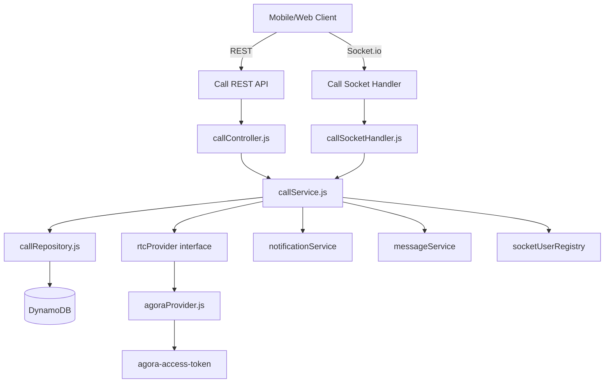
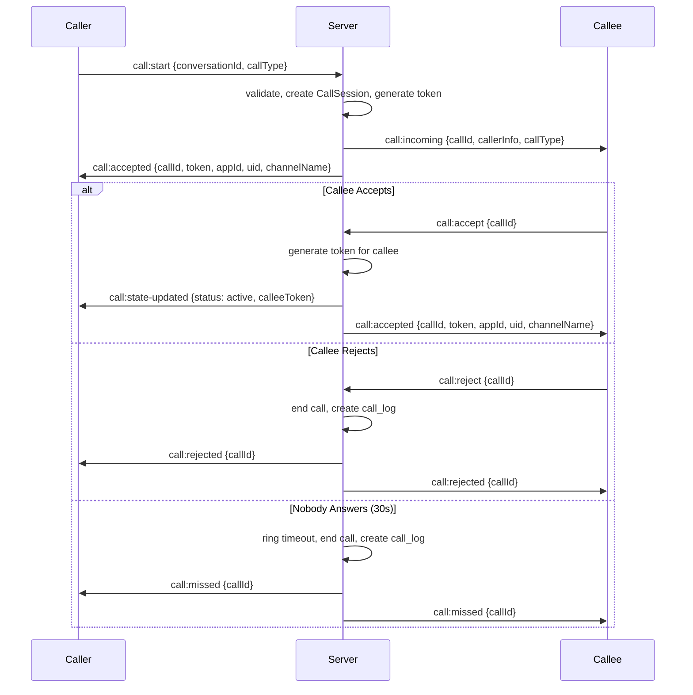
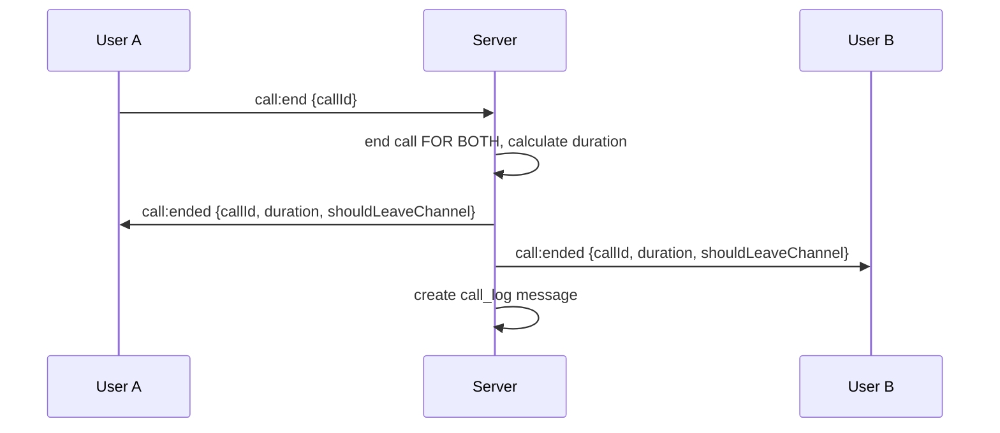
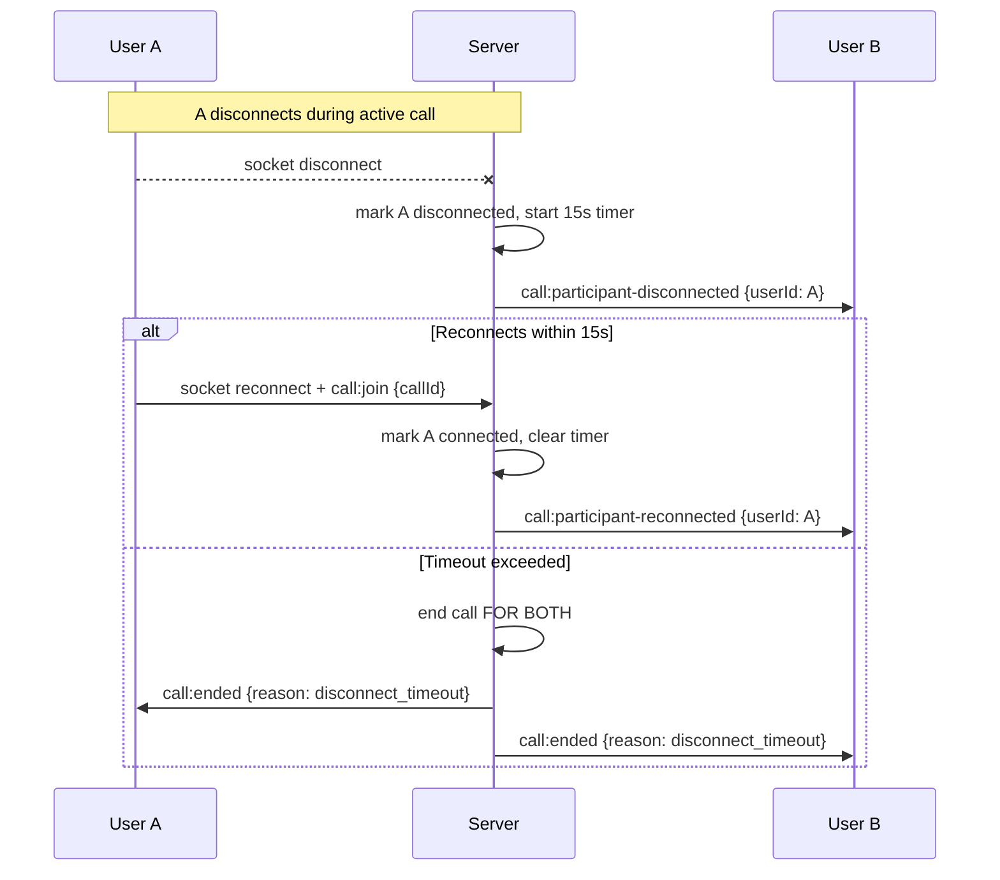
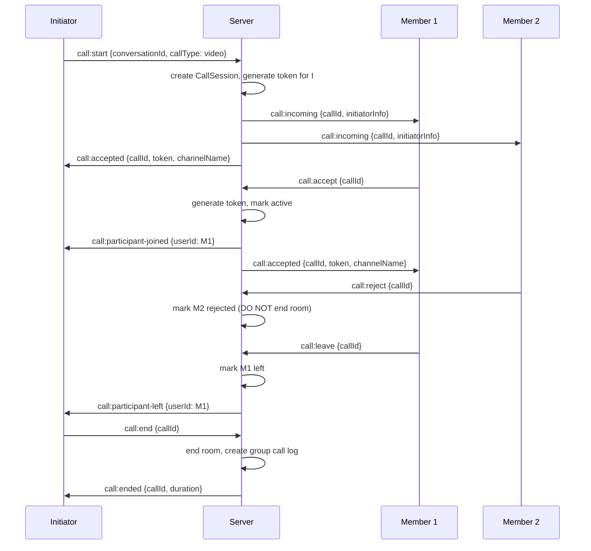

# Agora Call Architecture — Production Plan

## 1. Architecture Overview



## 2. File Structure

```
src/modules/calls/
  call.constants.js          # Statuses, types, modes, events, timeouts
  providers/
    rtcProvider.interface.js # Abstract provider contract
    agoraProvider.js         # Agora token generation implementation
  callModel.js               # DynamoDB table schema definition
  callRepository.js          # Data access layer with atomic operations
  callValidation.js          # Input validation functions
  callService.js             # Core business logic
  callController.js          # REST API handlers
  callRoutes.js              # Express route definitions
  callSocketHandler.js       # Socket event registration and handlers
```

## 3. Integration Points

### 3.1 Files Modified

| File | Change |
|------|--------|
| [`src/app.js`](src/app.js) | Import and register `callRoutes` at `/api/calls` |
| [`src/socket/socketHandler.js`](src/socket/socketHandler.js) | Import and delegate to `callSocketHandler.registerCallHandlers(io, socket)` |
| [`src/modules/messages/messageService.js`](src/modules/messages/messageService.js) | Re-add `"call_log"` to `VALID_CONTENT_TYPES` |
| [`.env`](.env) | Add `AGORA_APP_ID`, `AGORA_APP_CERTIFICATE`, `AGORA_TOKEN_EXPIRE_SECONDS` |

### 3.2 Files NOT Modified

- Auth middleware — used as-is via `req.user`
- Group service — used as-is for member queries
- Friend service — used as-is for DM conversation validation
- Notification service — used as-is for push notifications
- Socket user registry — used as-is for online user tracking
- Message model — call_log messages stored in existing `ott_messages` table

## 4. Data Model — DynamoDB Table `ott_call_sessions`

**Primary Key**: `callId` (String)

```json
{
  "callId": "call_1716742800000_a1b2c3",
  "conversationId": "dm:101:202",
  "initiatorId": "101",
  "callMode": "direct",
  "callType": "video",
  "provider": "agora",
  "channelName": "call_1716742800000_a1b2c3",
  "participants": [
    {
      "userId": "101",
      "role": "caller",
      "status": "accepted",
      "connectionState": "connected",
      "joinedAt": "2025-05-26T18:00:00.000Z",
      "leftAt": null,
      "disconnectedAt": null,
      "reconnectedAt": null
    },
    {
      "userId": "202",
      "role": "callee",
      "status": "accepted",
      "connectionState": "connected",
      "joinedAt": "2025-05-26T18:00:05.000Z",
      "leftAt": null,
      "disconnectedAt": null,
      "reconnectedAt": null
    }
  ],
  "status": "active",
  "endedReason": null,
  "endedBy": null,
  "startedAt": "2025-05-26T18:00:05.000Z",
  "endedAt": null,
  "durationSeconds": 0,
  "createdAt": "2025-05-26T18:00:00.000Z",
  "updatedAt": "2025-05-26T18:00:05.000Z"
}
```

**GSI**: `conversationId-index` on `conversationId` for querying active calls per conversation.

## 5. Constants

```js
// call.constants.js

CALL_STATUS = {
  RINGING: "ringing",
  ACTIVE: "active",
  ENDED: "ended",
  MISSED: "missed",
  REJECTED: "rejected",
  CANCELLED: "cancelled",
};

CALL_MODE = {
  DIRECT: "direct",
  GROUP: "group",
};

CALL_TYPE = {
  AUDIO: "audio",
  VIDEO: "video",
};

PARTICIPANT_STATUS = {
  INVITED: "invited",
  ACCEPTED: "accepted",
  REJECTED: "rejected",
  MISSED: "missed",
  LEFT: "left",
};

CONNECTION_STATE = {
  CONNECTED: "connected",
  DISCONNECTED: "disconnected",
};

ENDED_REASON = {
  USER_ENDED: "user_ended",
  CALLER_CANCELLED: "caller_cancelled",
  CALLEE_REJECTED: "callee_rejected",
  NO_ANSWER_TIMEOUT: "no_answer_timeout",
  DISCONNECT_TIMEOUT: "participant_disconnected_timeout",
  GROUP_EMPTY: "group_empty",
  SYSTEM_CLEANUP: "system_cleanup",
};

TIMEOUTS = {
  RING_TIMEOUT_MS: 30_000,
  RECONNECT_GRACE_MS: 15_000,
  TOKEN_EXPIRE_SECONDS: 3600,
};

SOCKET_EVENTS = {
  // Client → Server
  CALL_START: "call:start",
  CALL_ACCEPT: "call:accept",
  CALL_REJECT: "call:reject",
  CALL_CANCEL: "call:cancel",
  CALL_END: "call:end",
  CALL_JOIN: "call:join",
  CALL_LEAVE: "call:leave",

  // Server → Client
  CALL_INCOMING: "call:incoming",
  CALL_RINGING: "call:ringing",
  CALL_ACCEPTED: "call:accepted",
  CALL_REJECTED: "call:rejected",
  CALL_CANCELLED: "call:cancelled",
  CALL_ENDED: "call:ended",
  CALL_MISSED: "call:missed",
  CALL_PARTICIPANT_JOINED: "call:participant-joined",
  CALL_PARTICIPANT_LEFT: "call:participant-left",
  CALL_PARTICIPANT_DISCONNECTED: "call:participant-disconnected",
  CALL_PARTICIPANT_RECONNECTED: "call:participant-reconnected",
  CALL_STATE_UPDATED: "call:state-updated",
  CALL_BUSY: "call:busy",
};
```

## 6. Provider Abstraction

### 6.1 Interface

```js
// rtcProvider.interface.js
class IRtcProvider {
  generateToken(channelName, uid, role) { throw new Error("Not implemented"); }
  getAppId() { throw new Error("Not implemented"); }
  generateUid(userId) { throw new Error("Not implemented"); }
}
```

### 6.2 Agora Implementation

```js
// agoraProvider.js
const { RtcTokenBuilder, RtcRole } = require("agora-access-token");

class AgoraProvider extends IRtcProvider {
  generateToken(channelName, uid, role) {
    // RtcRole.PUBLISHER for all participants
    return RtcTokenBuilder.buildTokenWithUid(
      appId, appCertificate, channelName, uid, role, expireTimestamp
    );
  }
  generateUid(userId) {
    // Deterministic: hash userId to stable numeric int
    const hash = crypto.createHash("md5").update(String(userId)).digest();
    return hash.readUInt32BE(0) % 4294967295; // fit in uint32
  }
}
```

## 7. Socket Events — Full Flow

### 7.1 Direct Call Flow



### 7.2 Direct Call End Flow (Atomic)



### 7.3 Reconnect Flow



### 7.4 Group Call Flow



## 8. REST API Design

| Method | Path | Description |
|--------|------|-------------|
| POST | `/api/calls/start` | Start a call (auto-detect direct/group) |
| POST | `/api/calls/:callId/token` | Generate token for a participant |
| POST | `/api/calls/:callId/accept` | Accept incoming call |
| POST | `/api/calls/:callId/reject` | Reject incoming call |
| POST | `/api/calls/:callId/end` | End active call |
| GET | `/api/calls/history/:conversationId` | Paginated call history |

All routes protected by `authMiddleware` (JWT Bearer token).

## 9. Call Log Message Format

Stored in existing `ott_messages` table as `call_log` contentType:

```json
{
  "id": 1716742860000,
  "messageId": "uuid-here",
  "senderId": "101",
  "contentType": "call_log",
  "content": "Cuộc gọi video",
  "callData": {
    "callId": "call_xxx",
    "callMode": "direct",
    "callType": "video",
    "durationSeconds": 120,
    "callStatus": "completed",
    "endedReason": "user_ended",
    "initiatorId": "101",
    "acceptedCount": 1,
    "rejectedCount": 0,
    "missedCount": 0
  },
  "createdAt": "2025-05-26T18:02:00.000Z"
}
```

## 10. Memory Maps (Allowed)

Only two Maps allowed — both for timers, not state:

```js
const activeRingTimers = new Map();    // callId -> setTimeout ref
const reconnectGraceTimers = new Map(); // callId:userId -> setTimeout ref
```

All call state lives in DynamoDB. Timers are cleared on accept/reject/end/missed/cancel.

## 11. Environment Variables

```
AGORA_APP_ID=your_agora_app_id
AGORA_APP_CERTIFICATE=your_agora_app_certificate
AGORA_TOKEN_EXPIRE_SECONDS=3600
```

## 12. Dependencies

```json
{
  "agora-access-token": "^2.0.4"
}
```

## 13. Anti-Duplicate Call Logic

Before creating a new call, query DynamoDB for active/ringing call on the same conversationId:

```js
const existingCall = await callRepo.findActiveCallByConversation(conversationId);
if (existingCall) throw new Error("Active call already exists in this conversation");
```

Use DynamoDB conditional Put to prevent race conditions:

```js
await ddbDocClient.send(new PutCommand({
  TableName: CALLS_TABLE,
  Item: callSession,
  ConditionExpression: "attribute_not_exists(callId)"
}));
```

## 14. Agora UID Strategy

### Requirements
- **Deterministic**: Same `userId` MUST always produce the same Agora UID.
- **Never uid=0**: Agora reserves uid=0 for the SDK auto-assign path. Using 0 breaks token validation.
- **Never random**: A random UID per session prevents Agora from recognizing returning users.
- **Stable**: The mapping must be consistent across server restarts and multiple server instances.
- **Range**: Agora UID is a 32-bit unsigned integer (0 to 4,294,967,295). We constrain to 1–2,147,483,647 (positive int32 range) to avoid client SDK signed-int overflow issues.

### Algorithm

```js
const crypto = require("crypto");

/**
 * Generate a deterministic Agora UID from a userId string.
 * - Uses MD5 hash for speed (not cryptographic security).
 * - Result is always >= 1 (never uid=0).
 * - Result fits in a signed 32-bit integer (Agora SDK compatibility).
 * - Same input always produces the same output.
 *
 * @param {string|number} userId - The application user ID
 * @returns {number} A positive 32-bit integer suitable for Agora UID
 * @throws {Error} If userId is empty or invalid
 */
function generateUid(userId) {
  const id = String(userId ?? "").trim();
  if (!id) throw new Error("userId is required for UID generation");

  const hash = crypto.createHash("md5").update(id).digest();
  const raw = hash.readUInt32BE(0); // 0..4294967295
  const uid = (raw % 2147483647) + 1; // 1..2147483647 (never 0)
  return uid;
}
```

### Guarantees
| Property | Value |
|----------|-------|
| Deterministic | ✅ MD5 is deterministic; same input → same output |
| Never uid=0 | ✅ `(raw % 2147483647) + 1` → minimum is 1 |
| Never random | ✅ No `Math.random()` or `Date.now()` |
| Stable across restarts | ✅ Pure function of userId, no server state |
| Collision-resistant | ✅ 2.1B possible values; collisions astronomically unlikely for typical user counts |
| Signed int32 safe | ✅ Max value 2,147,483,647 — safe for all Agora client SDKs |

### Usage in Token Generation

```js
// In agoraProvider.js
const uid = generateUid(userId); // deterministic, never 0
const token = RtcTokenBuilder.buildTokenWithUid(
  appId, appCertificate, channelName, uid, RtcRole.PUBLISHER, expireTimestamp
);
// Return both token AND uid to client so they join with the exact same uid
return { token, uid, appId, channelName };
```

### Critical: Token-UID Match
Agora enforces that the uid embedded in the token must match the uid passed to `joinChannel()` on the client. The server generates the uid deterministically and returns it alongside the token. The client MUST use this exact uid value — never compute it locally or use a different value.

## 15. Push Notification Integration

On `call:incoming`, if target user is offline (not in `onlineUsers` Map), send Firebase push:

```js
{
  notification: {
    title: callType === "video" ? "Cuộc gọi video đến" : "Cuộc gọi thoại đến",
    body: `${callerName} đang gọi cho bạn`
  },
  data: {
    type: "incoming_call",
    callId,
    callerId,
    callerName,
    callType,
    callMode
  }
}
```

## 16. Implementation Order

1. `call.constants.js` — zero dependencies, defines all constants
2. `providers/rtcProvider.interface.js` — abstract interface
3. `providers/agoraProvider.js` — Agora implementation
4. `callModel.js` — DynamoDB schema definition
5. `callRepository.js` — data access layer
6. `callValidation.js` — input validation
7. `callService.js` — business logic (depends on all above)
8. `callController.js` — REST handlers (depends on service)
9. `callRoutes.js` — Express routes (depends on controller)
10. `callSocketHandler.js` — Socket handlers (depends on service)
11. Integration: `app.js`, `socketHandler.js`, `messageService.js`, `.env`

## 17. Busy-State Handling (Zalo-like Behavior)

### Requirement
When a user is already in an **active** or **ringing** call, any incoming call attempt targeting that user MUST be rejected by the server with a `call:busy` event — the user's phone should NOT ring again.

### Rules

| Scenario | Behavior |
|----------|----------|
| User A is in active/ringing call, User B tries to call User A | Server emits `call:busy` to User B; no `call:incoming` sent to User A |
| User A is in group call, someone tries direct call to User A | Same — `call:busy` emitted to caller |
| User A is in direct call, someone tries group call invite for User A | Same — `call:busy` emitted to inviter |
| User A's call just ended (status=ended), new call arrives | Normal flow — no busy state |

### Implementation

```js
// In callService.js — before creating a new call or sending call:incoming

/**
 * Check if a user is currently busy in any active/ringing call.
 * @param {string} userId
 * @returns {Promise<{busy: boolean, callId?: string}>}
 */
async function isUserBusy(userId) {
  // Scan ott_call_sessions for active/ringing calls where userId is a participant
  // Use GSI or scan with filter:
  //   #status IN (:active, :ringing) AND contains(participants, :userId)
  const result = await ddbDocClient.send(new ScanCommand({
    TableName: CALLS_TABLE,
    FilterExpression:
      "(#status = :active OR #status = :ringing) AND contains(participants, :userId)",
    ExpressionAttributeNames: { "#status": "status" },
    ExpressionAttributeValues: {
      ":active": "active",
      ":ringing": "ringing",
      ":userId": userId,
    },
  }));
  const items = result.Items || [];
  if (items.length > 0) {
    return { busy: true, callId: items[0].callId };
  }
  return { busy: false };
}
```

### Socket Event

```js
// Server → Client (caller receives this when callee is busy)
SOCKET_EVENTS.CALL_BUSY: "call:busy"
```

**Payload:**
```json
{
  "callId": "call_xxx",
  "targetUserId": "202",
  "reason": "user_busy",
  "message": "Người dùng đang trong cuộc gọi khác"
}
```

### Client-Side Handling
When the client receives `call:busy`:
1. Show toast/dialog: "Người dùng đang bận" (User is busy)
2. Do NOT play ringing tone
3. Transition to call-ended state immediately
4. Do NOT create a call_log entry (the call was never established)

### Memory Efficiency
The `isUserBusy` check uses a DynamoDB scan which is acceptable because:
- Active/ringing calls are a tiny subset of all calls (most are status=ended)
- DynamoDB scans only return matching items, not the full table
- For optimization in Phase 2+, add a GSI on `status` + use `FilterExpression` on participants

## 18. Conversation Resolution (DB-first)

### Problem
The previous implementation used `inferCallMode(conversationId)` and `extractDmMembers(conversationId)` which parsed the `dm:userA:userB` string format to determine call mode and members. This is fragile and tightly coupled to the conversationId format convention.

### Solution: `resolveConversation(conversationId)`
A single helper in `callService.js` that resolves conversation metadata from DynamoDB:

```
1. Query ott_groups with conversationId as groupId (GetCommand)
2. If found → group conversation
   - callMode = "group"
   - members from ott_group_members table
   - groupType from ott_groups.type
3. If not found → DM conversation (fallback)
   - callMode = "direct"
   - members parsed from "dm:userA:userB" format (unavoidable — no DM table exists)
   - groupType = null
```

### Key Properties
- **DB-first**: Group type and members always come from the database
- **Single parsing point**: DM string parsing is isolated in one function, not scattered across validation/service layers
- **No exported parsing helpers**: `inferCallMode()` and `extractDmMembers()` are removed from the public API
- **`validateStartCallInput`** only validates input format; callMode determination happens after DB resolution

### Call Flow (updated)
```
startCall() →
  1. validateStartCallInput(userId, conversationId, callType) → { callType }
  2. resolveConversation(conversationId) → { callMode, members, groupType }
  3. if group + audio → reject (GROUP_AUDIO_NOT_ALLOWED)
  4. verify caller is member → proceed
  ...rest of call creation
```

## 19. Idempotent call_log Creation

### Problem
Multiple code paths can trigger `createCallLogMessage()` for the same call:
- Retry after timeout
- Double end-call from two participants simultaneously
- Timeout race vs. explicit end
- Reconnect race

### Solution: `callLogCreated` boolean flag

**Field**: `callLogCreated: boolean` (default `false`) on every call session item.

**Atomic Guard**: `markCallLogCreated(callId)` uses a DynamoDB conditional update:
```
UpdateExpression: "SET callLogCreated = :true"
ConditionExpression: "callLogCreated = :false"
```

- Returns `true` → caller proceeds to create the call_log message
- Returns `false` (ConditionalCheckFailedException) → another request already created it, skip

**Flow in `createCallLogMessage()`**:
```
1. if callSession.callLogCreated → return early (fast path, no DB write)
2. markCallLogCreated(callId) → if false → return early (race lost)
3. saveMessage({ contentType: "call_log", ... })
```

The flag is set BEFORE the message write to prevent any possibility of double-creation.

## 20. Active Call Recovery (`GET /api/calls/active`)

### Purpose
When a client recovers from crash, background, or network loss, it needs to know if the user is currently in a call and get a fresh token to rejoin.

### Endpoint
```
GET /api/calls/active
Authorization: Bearer <jwt>

Response (in call):
{
  "call": { callId, conversationId, status, participants, ... },
  "token": { appId, token, uid, channelName, expireAt }
}

Response (no active call):
{
  "call": null,
  "token": null
}
```

### Client Startup Flow
```
App launches / resumes →
  1. Reconnect socket (socket.connect())
  2. GET /api/calls/active
     - If call exists + token → show in-call UI, use token to join Agora channel
     - If call exists + no token → call ended between request and response, ignore
     - If null → no active call, proceed normally
  3. Socket events will take over for real-time updates from here
```

### Why REST + Socket (not socket-only)?
- Socket may not be connected yet when the app resumes
- REST is guaranteed to return the current state at request time
- Socket call events handle real-time updates AFTER recovery
- This is a point-in-time snapshot, not a subscription
